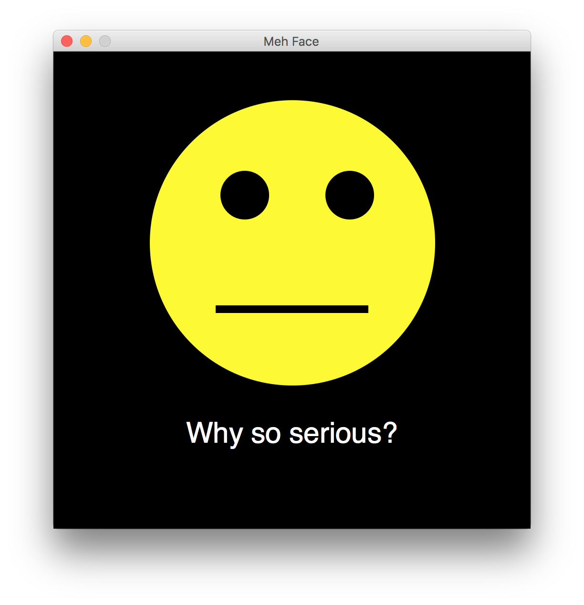

# Notes from January 30th 2019
“One thing that separates good programmers from bad programmers is that good programmers are more facile at jumping between layers of abstraction—they can keep the layers distinct while making changes and choose the right layer to make changes in.” 

<cite>- Peter Seibel, *Coders at Work*</cite>

## The Graphics Library
Contains multiple *class* definitions to aid in building GUI's (graphical user interfaces) and drawing points, shapes, and lines.

## Object
>An *active* data type that combines both data (properties or instance variables) and operations (methods).

## Class
>A defintion that describes the properties and methods an object will have.

## Instance
>A particular unit or occurance of a class object.

## Instantiation
>The process of creating an *instance* of an *class* (i.e. a new object) by invoking the *class* definition.

## Properties
>Variables belonging to an object. They are used to store data specific to an object. Also called *instance variables*.

## Methods
>Function definitions belonging to an object. They are used to produce actions on behalf of an object.

# Example

If a car is an ***object*** in the most literal sense, then a ***class*** would be the blueprints and engineering documents used to create a new car. The process of actually assembling the new car is ***instantiation.*** The new car created has values for its own ***properties*** (e.g. gas tank level) and can perform actions or ***methods*** (e.g. drive). This particular car that we just hypothetically built is an ***instance*** of the car class.

## Accessors
>Methods that return the value of an instance variable.

## Mutators
>Methods that change the *state* of an object (e.g. modifying the value of an instance variable).

## Alias
When assigning an object to a second (or third, etc.) variable, Python does not \*copy\* the object by default. Instead, it creates another variable that points to the exact same object. This is called an *alias*.

# Code Samples
Check out these student submitted code samples. 
*Note: permission granted by students prior to sharing.*

Ivan's "meh" face. 
 
Link to [code](../examples/lecture07_student_ivan.py)

## Et Cetera
* Slides for [Chapter 04](http://mcsp.wartburg.edu/zelle/python/ppics3/slides/Chapter04.pptx)
* Examples for [Lecture 07](../examples/lecture07.py)
* Dog Example for [Lecture 07a](../examples/lecture07a.py)
* The graphics.py [file download](https://canvas.seattlecentral.edu/courses/1411133/files/76130838/download?wrap=1) for Chapter 04
* Repl.it Development Environment: [https://repl.it](https://repl.it/)
